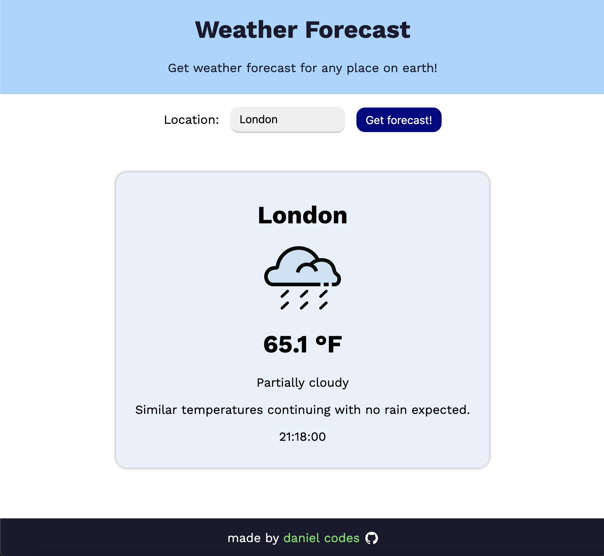
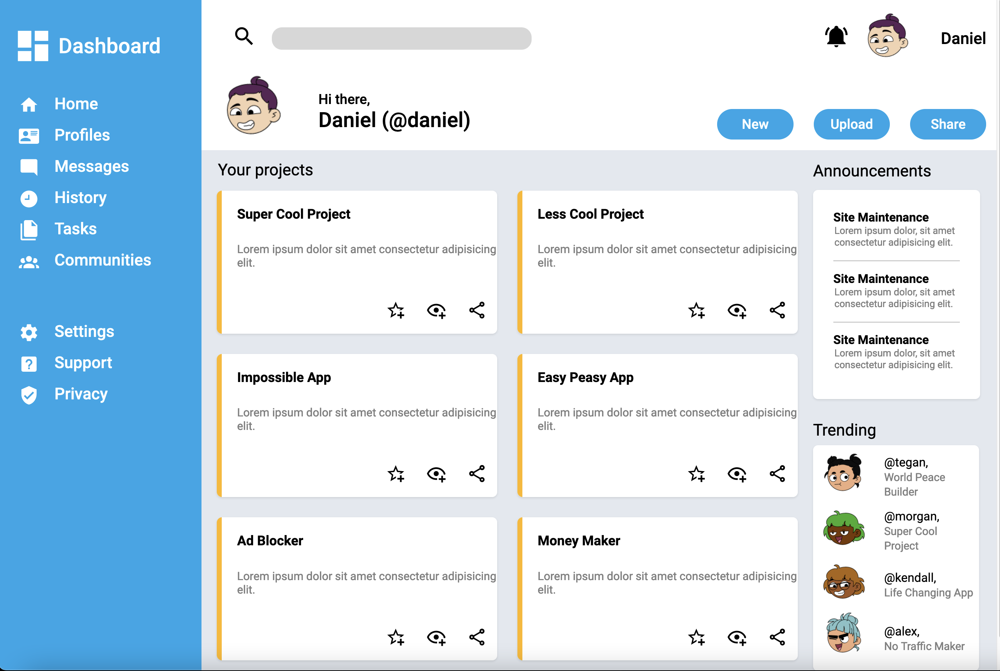
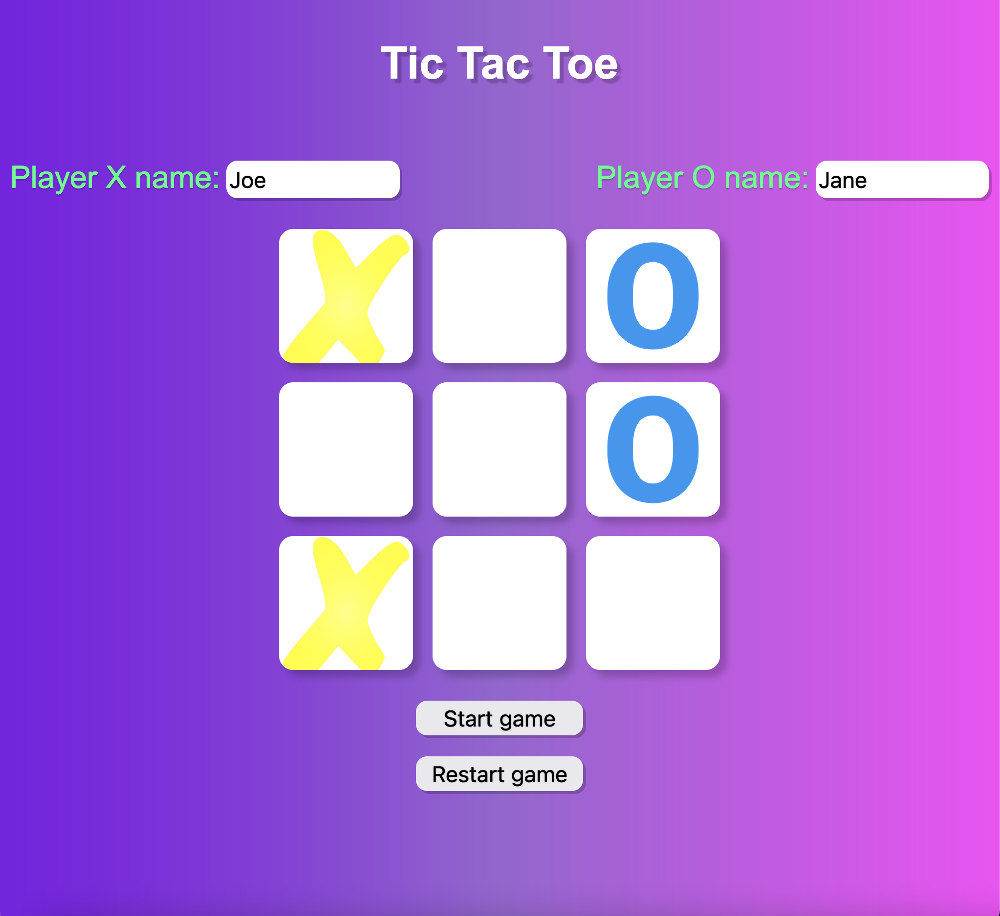
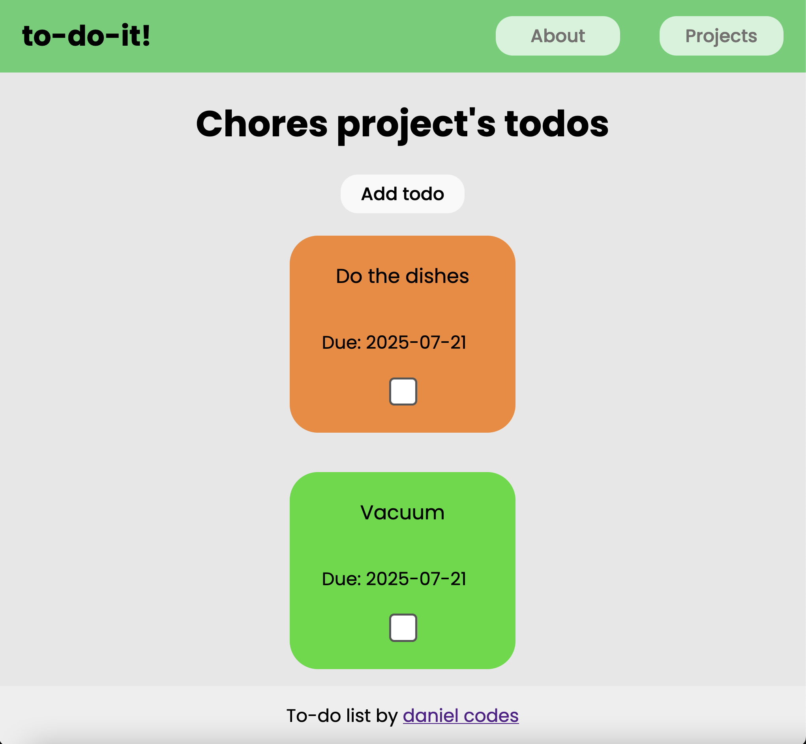
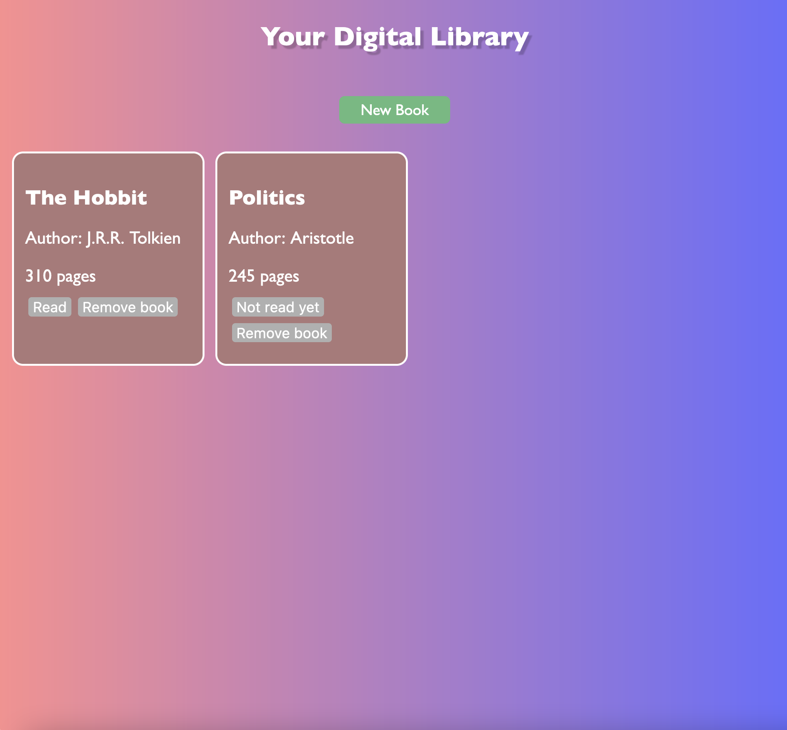

# The Odin Project Full Stack JavaScript — Live Projects

Welcome to the live versions of my projects from **The Odin Project**!  
This branch hosts the projects I built as part of the [The Odin Project Full Stack JavaScript course](https://www.theodinproject.com/paths/full-stack-javascript).

---

## 🚀 Live Projects

Check out my projects running on GitHub Pages:

- [Admin Dashboard](https://danny-codes.github.io/TheOdinProjectRepo/admin-dashboard/index.html)
- [Sign Up Form](https://danny-codes.github.io/TheOdinProjectRepo/sign-up-form/index.html)
- [Tic-Tac-Toe Game](https://danny-codes.github.io/TheOdinProjectRepo/tic-tac-toe/index.html)
- [Digital Library](https://danny-codes.github.io/TheOdinProjectRepo/library-project/index.html)
- [Restaurant Page](https://danny-codes.github.io/TheOdinProjectRepo/restaurant-page/dist/index.html)
- [To-Do List](https://danny-codes.github.io/TheOdinProjectRepo/todo-list/dist/index.html)
- [Weather App](https://danny-codes.github.io/TheOdinProjectRepo/weather-app/dist/index.html)

---

## 📚 🛠 Skills & Tools Learned 

Throughout these projects, I developed practical skills and worked with modern JavaScript tools, including:

- **JavaScript fundamentals:** DOM Manipulation, Event Handling, Data Structures & Algorithms, Form Validation  
- **Asynchronous JavaScript & APIs:** Handling async code with `async/await`, fetching and processing data from public APIs (e.g., Weather App)  
- **Application state management:** Using `localStorage` for data persistence in the Todo List project  
- **Modular architecture:** Writing clean, maintainable code with ES6 modules, factory functions, and classes  
- **Responsive UI Design:** Building layouts with CSS Flexbox and Grid for mobile-friendly interfaces  
- **Tooling:** Using Webpack and npm for bundling, package management, and asset optimization  
- **Libraries:** Utilizing helpful npm packages such as `date-fns` for date manipulation and formatting  

These combined skills showcase a full-stack JavaScript foundation and modern web development best practices.

---

## 🛠 Technologies Used

<p align="left">
  <a href="https://developer.mozilla.org/en-US/docs/Web/CSS" target="_blank" rel="noreferrer">
    
  </a>
  <a href="https://developer.mozilla.org/en-US/docs/Web/HTML" target="_blank" rel="noreferrer">
    
  </a>
  <a href="https://developer.mozilla.org/en-US/docs/Web/JavaScript" target="_blank" rel="noreferrer">
    
  </a>
</p>

---

## Screenshots

### Weather App

A simple weather dashboard that fetches live weather data from a weather API.  
Built with modern JavaScript using Webpack and npm for bundling.



[Weather App Link](https://danny-codes.github.io/TheOdinProjectRepo/weather-app/dist/index.html)

---

### Admin Dashboard

A static admin dashboard built using **HTML** and **CSS Grid**.

- Demonstrates a clean, responsive layout using CSS Grid for positioning elements.
- Focuses on practicing modern layout techniques without JavaScript.
- Includes cards, navigation, and placeholder charts for layout structure.



[Admin Dashboard Link](https://danny-codes.github.io/TheOdinProjectRepo/admin-dashboard/index.html)

---

### Tic Tac Toe Game

A browser-based Tic Tac Toe game with interactive gameplay.
- Uses modular JavaScript patterns (factories, IIFEs) to organize game logic.
- Implements win/tie detection and enforces game rules.
- Lets players enter names, restart the game, and displays game outcomes.
- Focuses on managing game state and updating the DOM accordingly.



[Tic-Tac-Toe Game Link](https://danny-codes.github.io/TheOdinProjectRepo/tic-tac-toe/index.html)

---

### Todo List

A fully functional todo list application with:

- Creation, editing, and deletion of tasks and projects  
- Task prioritization and completion toggles  
- Persistent storage using the Web Storage API (`localStorage`)

The app emphasizes clean modular code, separation of concerns, and responsive design.



[To-Do List Link](https://danny-codes.github.io/TheOdinProjectRepo/todo-list/dist/index.html)

---

### Digital Library

A simple app to manage a personal library of books.

- Uses a Book constructor and an array to store book objects with unique IDs.
- Allows adding, removing, and toggling read status of books via a form and buttons.
- Demonstrates separation of data management from UI rendering.
- Practices event handling, DOM manipulation, and working with data structures.



[Digital Library Link](https://danny-codes.github.io/TheOdinProjectRepo/library-project/index.html)

---

## 📚 Prerequisite Foundations

These projects build upon the fundamentals I practiced in **The Odin Project JavaScript Foundations** course.

➡️ You can view those foundational exercises and projects here: [FoundationsJS Repository](https://github.com/danny-codes/FoundationsJS)

---

## 🔄 How to Update

1. Make changes to your local project (e.g., **tic-tac-toe**).  
2. Commit changes on your local `main` branch:
   ```bash
   git add .
   git commit -m "Update [project name]"
